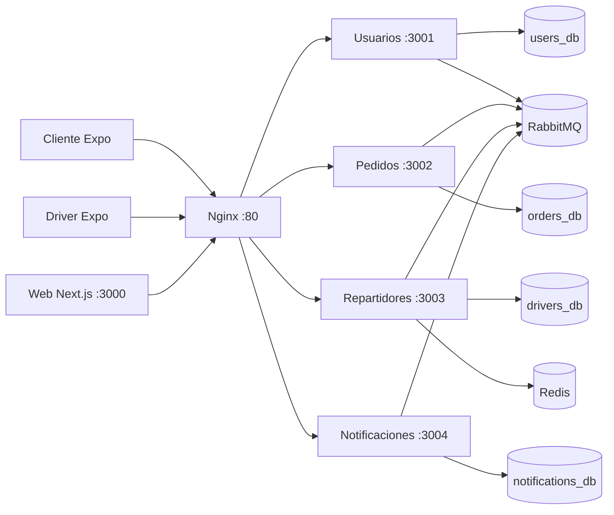

# DeliverEats Ayacucho

Plataforma distribuida para gestionar pedidos multi-negocio, comercios y repartidores en Ayacucho, Perú. Incluye una web Next.js para administración y comercios, dos apps Expo, cuatro microservicios NestJS y un entorno local completo con PostgreSQL, Redis, RabbitMQ, Nginx y Mailpit.

## Capacidades

- Autenticación JWT por roles `CUSTOMER`, `DRIVER`, `MERCHANT` y `ADMIN`, refresh rotation, bloqueo por fuerza bruta y cookies HttpOnly en web.
- Catálogo, carrito de varios comercios, cupón `PDGP10` y cálculo de checkout únicamente en servidor.
- Pedido con subpedidos, snapshots de productos, transiciones controladas y actualización Socket.IO.
- Pagos mock demostrables para Yape/Plin/tarjeta y adaptador oficial de Mercado Pago preparado.
- Reserva atómica de drivers, oferta de 15 segundos, múltiples recojos y protección contra doble asignación.
- Tracking GPS cada cinco segundos, Redis con TTL, WebSocket y polling REST de respaldo.
- RabbitMQ durable con ACK, publisher confirms, reintentos, idempotencia y DLQ.
- Notificaciones in-app funcionales, SMTP local con Mailpit y Firebase preparado.
- Dashboards responsive con gestión real de usuarios, drivers, comercios, productos, pedidos, pagos y promociones.

## Arquitectura



El diseño y las decisiones de consistencia están en [docs/architecture.md](docs/architecture.md).

## Requisitos

- Docker Desktop con Docker Compose v2.
- Node.js 22 o 24.
- Corepack y pnpm 11 (`corepack enable`).
- Para mobile: Android Studio, Xcode o un dispositivo con Expo Go compatible con SDK 54.

## Inicio rápido

Desde la raíz del repositorio:

```bash
pnpm install
cp .env.example .env
docker compose up -d --build
pnpm db:migrate
pnpm db:seed
```

En PowerShell, el segundo comando es:

```powershell
Copy-Item .env.example .env
```

Los contenedores ejecutan migraciones al iniciar; `pnpm db:migrate` es idempotente y también permite verificarlas explícitamente desde el host. `pnpm db:seed` puede repetirse sin duplicar los datos demo.

Comprueba el entorno:

```bash
docker compose ps
curl http://localhost/api/users/health
curl http://localhost/api/orders/health
curl http://localhost/api/drivers/health
curl http://localhost/api/notifications/health
```

## URLs

| Recurso                | URL                                     |
| ---------------------- | --------------------------------------- |
| Web y gateway          | http://localhost                        |
| Web directa            | http://localhost:3000                   |
| Swagger Usuarios       | http://localhost/api/users/docs         |
| Swagger Pedidos        | http://localhost/api/orders/docs        |
| Swagger Repartidores   | http://localhost/api/drivers/docs       |
| Swagger Notificaciones | http://localhost/api/notifications/docs |
| RabbitMQ Management    | http://localhost:15672                  |
| Mailpit                | http://localhost:8025                   |

Las credenciales locales de RabbitMQ están en `.env`. No se deben reutilizar fuera de desarrollo.

## Usuarios demo

Todos usan la contraseña exclusiva de desarrollo `Demo12345!`.

| Rol      | Correo                       | Destino web/app |
| -------- | ---------------------------- | --------------- |
| Cliente  | `cliente@delivereats.local`  | Mobile cliente  |
| Driver   | `driver@delivereats.local`   | Mobile driver   |
| Comercio | `comercio@delivereats.local` | `/comercio`     |
| Admin    | `admin@delivereats.local`    | `/admin`        |

## Apps móviles

```bash
pnpm mobile:client
pnpm mobile:driver
```

Para un emulador Android usa `http://10.0.2.2/api` como `EXPO_PUBLIC_API_URL`. En un dispositivo físico, reemplaza `localhost` por la IP LAN del equipo que ejecuta Docker:

```bash
EXPO_PUBLIC_API_URL=http://192.168.1.20/api EXPO_PUBLIC_SOCKET_URL=http://192.168.1.20 pnpm mobile:client
```

En PowerShell define esas variables con `$env:EXPO_PUBLIC_API_URL=...` antes del comando.

## Integraciones

| Integración           | Desarrollo por defecto                               | Producción preparada                              |
| --------------------- | ---------------------------------------------------- | ------------------------------------------------- |
| Yape / Plin / tarjeta | `PAYMENTS_MODE=mock`, aprobación desde Admin → Pagos | Adapter sustituible; no se afirma una API privada |
| Mercado Pago          | Mock si no hay token                                 | SDK oficial + webhook y consulta al proveedor     |
| Mapas                 | Haversine y rutas lineales                           | `GOOGLE_MAPS_API_KEY` / proveedor configurable    |
| Email                 | SMTP real contra Mailpit                             | SMTP configurable                                 |
| Push                  | Provider mock                                        | Firebase Admin con service account JSON           |
| SMS                   | Interfaz preparada, sin envío ficticio               | Proveedor por implementar al contratarlo          |

Para Mercado Pago establece `PAYMENTS_MODE=mercadopago`, `MERCADOPAGO_ACCESS_TOKEN`, `MERCADOPAGO_PUBLIC_KEY` y `MERCADOPAGO_WEBHOOK_SECRET`. Para Firebase establece `PUSH_PROVIDER=firebase` y `FIREBASE_SERVICE_ACCOUNT_JSON` con JSON válido. Ninguna credencial real se incluye en Git.

## Flujo demo recomendado

Sigue [docs/demo.md](docs/demo.md). El recorrido principal agrega el kit de Botica y el pack de Fresh Market, aplica `PDGP10`, aprueba Yape en el admin, ofrece el pedido a un driver, confirma dos recojos, transmite GPS, entrega y califica.

## Desarrollo y calidad

```bash
pnpm lint
pnpm typecheck
pnpm test
pnpm build
pnpm test:e2e
```

`pnpm test:e2e` se activa al definir `E2E_BASE_URL=http://localhost` y requiere Docker inicializado y datos seed. El test de concurrencia se activa con `DRIVERS_TEST_DATABASE_URL` y usa una base aislada. Consulta [docs/testing.md](docs/testing.md).

La colección Postman está en [docs/api/delivereats.postman_collection.json](docs/api/delivereats.postman_collection.json).

## Estructura

```text
apps/              web, mobile-client, mobile-driver
services/          users, orders, drivers, notifications
packages/          tipos, configuración, utilidades y kit backend
infrastructure/    Dockerfiles y Nginx
docs/              arquitectura, demo, pruebas y colección API
tests/e2e/          flujo HTTP multi-negocio
```

## Operación y solución de problemas

- Ver logs: `docker compose logs -f orders-service drivers-service`.
- Reintentar un build: `docker compose build --no-cache <servicio>`.
- Ver mensajes y colas: RabbitMQ Management → Queues and Streams.
- Ver emails: abre Mailpit; no se envían a Internet en modo local.
- Si el puerto 80 está ocupado, cambia el mapeo de `nginx` en `docker-compose.yml` y ajusta las URLs públicas.
- Si un móvil no conecta, confirma firewall, IP LAN y que ambos dispositivos estén en la misma red.
- `docker compose down -v` elimina de forma irreversible las bases y colas locales; úsalo solo para reiniciar todos los datos demo.

## Seguridad

Los valores de `.env.example` son marcadores de desarrollo. Antes de un entorno compartido, cambia JWT, secreto interno, PostgreSQL y RabbitMQ; habilita TLS en el proxy; restringe CORS; configura webhooks HTTPS; y utiliza un gestor de secretos.
