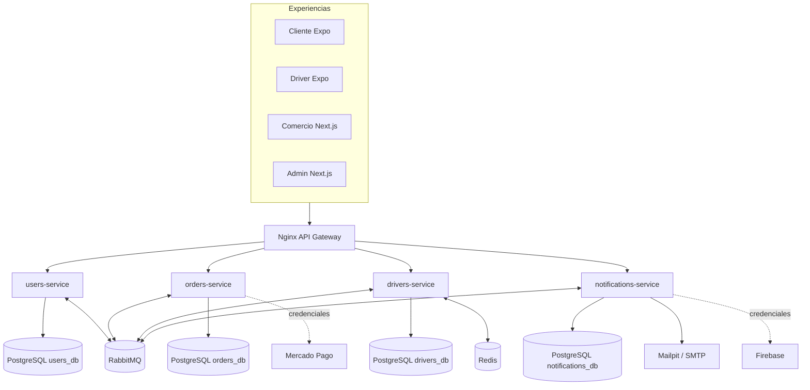
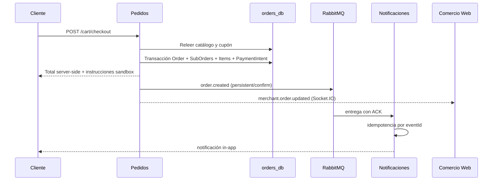
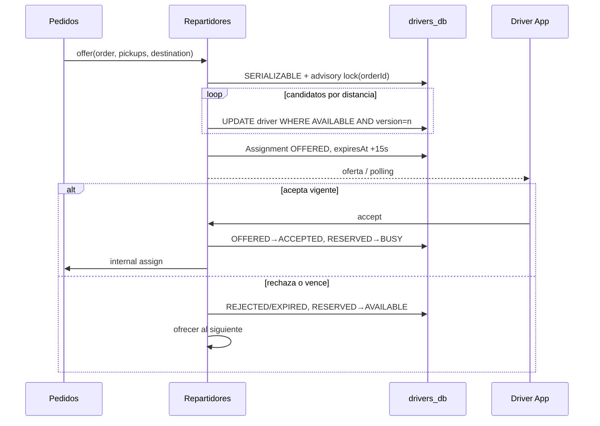
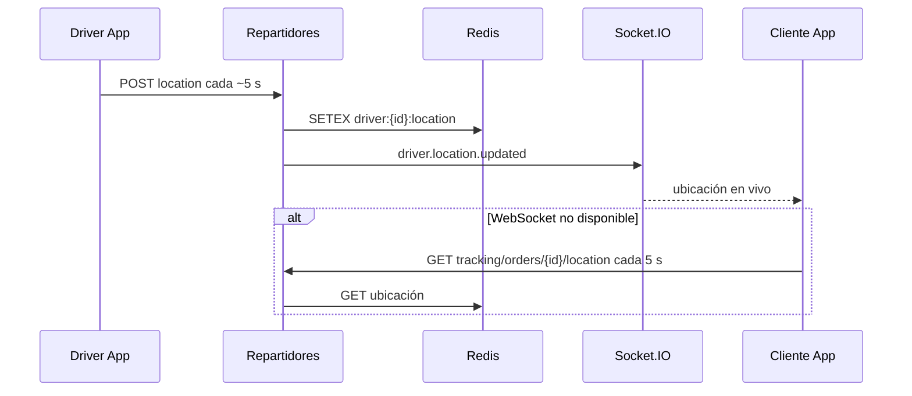
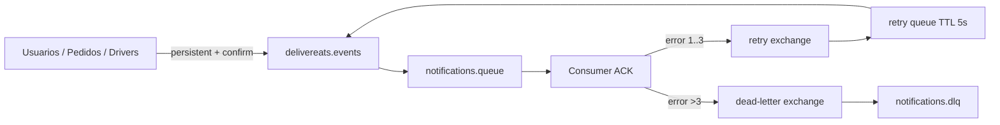

# Arquitectura de DeliverEats Ayacucho

## Componentes

El monorepo conserva exactamente cuatro dominios desplegables. Usuarios es dueño de identidades, sesiones, perfiles de cliente y auditoría. Pedidos es dueño de comercios, catálogo, carrito, promociones, pagos y órdenes. Repartidores es dueño de disponibilidad, ofertas, asignaciones y tracking. Notificaciones materializa eventos en mensajes in-app y delega email o push a providers.

No existen foreign keys entre bases. Los identificadores de usuario, pedido y driver que cruzan servicios son referencias lógicas. Nginx unifica REST y los upgrades de Socket.IO, y propaga `X-Correlation-ID`.

## Secuencia de pedido

El cliente solo envía producto/cantidad y destino. Pedidos relee precios y disponibilidad, valida el cupón, calcula `subtotal + deliveryFee + serviceFee - discount`, crea `Order`, `SubOrder` y snapshots de `OrderItem` en una transacción, vacía el carrito y publica `order.created`.

## Pago y confirmación

`PAYMENTS_MODE=mock` genera un `PaymentIntent` explícitamente sandbox. Solo un admin puede llamar `mock-decision`; al aprobar, el backend cambia pago y pedido a `CONFIRMED` y emite `payment.approved`/`order.confirmed`. En Mercado Pago, el frontend nunca aprueba: el webhook dispara una consulta al SDK oficial y se persiste el estado retornado por el proveedor.

## Asignación concurrente

La búsqueda ordena drivers `AVAILABLE` por Haversine respecto al primer recojo. La transacción serializable toma un advisory lock por `orderId`; para cada candidato ejecuta un `updateMany` condicionado por `status` y `version`. Solo el update que afecta una fila convierte `AVAILABLE → RESERVED`. Esto evita que pedidos simultáneos reserven al mismo driver. Al aceptar, otra transacción reclama la oferta no vencida y cambia `RESERVED → BUSY`. Tras entregar cambia `BUSY → AVAILABLE`.

## Tracking

La app solicita permiso y, durante una asignación aceptada, envía coordenadas aproximadamente cada cinco segundos. Repartidores valida que el driver esté `BUSY` y sea dueño de la asignación. La última posición se guarda como `driver:{id}:location` con TTL en Redis; una muestra se persiste en PostgreSQL como máximo una vez por minuto. Si Redis no está disponible, el store degrada a memoria y el health check lo evidencia.

## Eventos y resiliencia

El exchange topic `delivereats.events` y las colas son durables; los mensajes se publican persistentes con confirmación. Notificaciones hace ACK solo después de persistir/entregar. Los fallos se reencolan mediante una retry queue con TTL de cinco segundos y dead-letter exchange; tras tres intentos van a DLQ. `eventId` único hace idempotente el consumo. Esto reduce pérdida y duplicación, sin prometer garantía absoluta ante todos los fallos posibles.

## Seguridad y observabilidad

- JWT de 15 minutos y refresh de siete días almacenado únicamente como hash BCrypt.
- Cookies HttpOnly para web y SecureStore para mobile.
- RBAC en guards y middleware web; autorización de propiedad dentro de servicios.
- Helmet, CORS configurable, throttling y `ValidationPipe` con whitelist/transform.
- Errores homogéneos con código y correlation ID; no se registran passwords, tokens ni API keys.
- Las llamadas internas exigen `INTERNAL_SERVICE_SECRET` y propagan correlación.
- Health checks verifican base y, cuando aplica, Redis/RabbitMQ.
