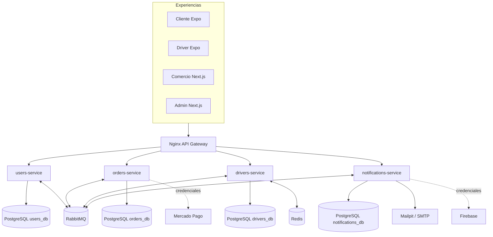
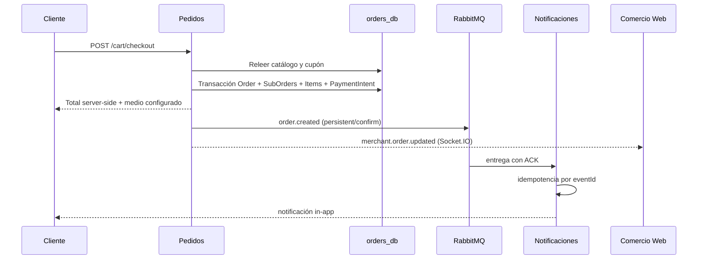
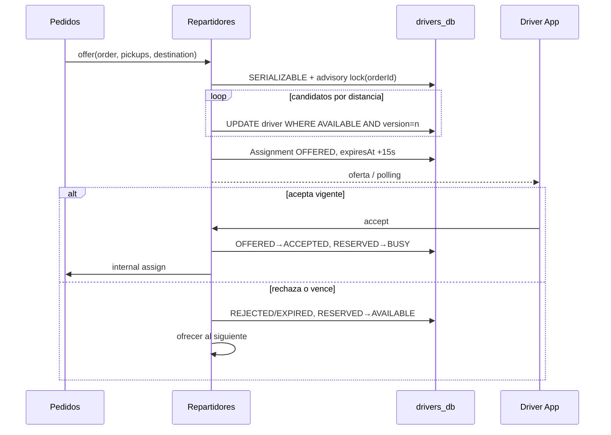
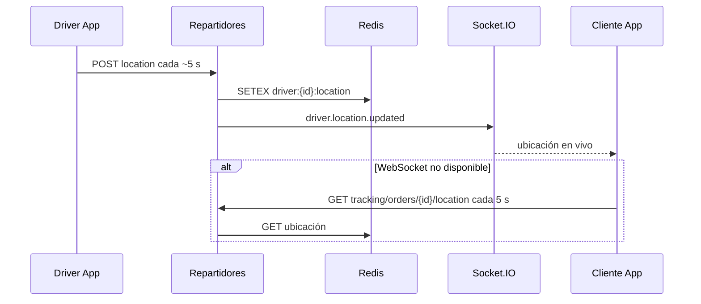
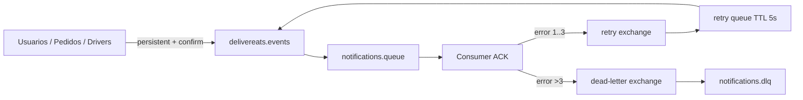

# Arquitectura de DeliverEats Ayacucho

## Componentes

El monorepo conserva exactamente cuatro dominios desplegables. Usuarios es dueño de identidades, sesiones, perfiles de cliente y auditoría. Pedidos es dueño de comercios, catálogo, carrito, promociones, pagos y órdenes. Repartidores es dueño de disponibilidad, ofertas, asignaciones y tracking. Notificaciones materializa eventos en mensajes in-app y delega email o push a providers.

No existen foreign keys entre bases. Los identificadores de usuario, pedido y driver que cruzan servicios son referencias lógicas. Nginx unifica REST y los upgrades de Socket.IO, y propaga `X-Correlation-ID`.

## Secuencia de pedido

El cliente solo envía producto/cantidad y destino. Pedidos relee precios y disponibilidad, valida el cupón, calcula `subtotal + deliveryFee + serviceFee - discount`, crea `Order`, `SubOrder` y snapshots de `OrderItem` en una transacción, vacía el carrito y publica `order.created`.

## Pago y confirmación

No hay aprobación de pagos simulada. CASH se confirma como cobrado al registrar la entrega. Yape/Plin manual requieren cuenta, QR, referencia única y evidencia; un administrador distinto del cliente revisa el comprobante. Mercado Pago utiliza el SDK oficial, verifica la firma del webhook, consulta el pago y contrasta importe, moneda, referencia y cuenta de producción. Volver a la pantalla de éxito no aprueba nada. Un pago tardío tras cancelación abre conciliación/reembolso, no reactiva la entrega. Sin credenciales el método externo permanece deshabilitado.

## Asignación concurrente

La búsqueda ordena drivers `AVAILABLE` por Haversine respecto al primer recojo. La transacción serializable toma un advisory lock por `orderId`; para cada candidato ejecuta un `updateMany` condicionado por `status` y `version`. Solo el update que afecta una fila convierte `AVAILABLE → RESERVED`. Esto evita que pedidos simultáneos reserven al mismo driver. Al aceptar, otra transacción reclama la oferta no vencida y cambia `RESERVED → BUSY`. Tras entregar cambia `BUSY → AVAILABLE`.

## Tracking

La app solicita permiso y, mientras permanece en primer plano, envía coordenadas aproximadamente cada cinco segundos durante disponibilidad y entregas. Repartidores verifica la sesión, aprobación y propiedad de la asignación. Redis conserva la última muestra con TTL; las muestras desordenadas o demasiado antiguas se rechazan y el cliente ve cuándo la ubicación está desactualizada. No existe GPS inventado ni fallback del servidor a memoria cuando Redis falla. El buffer móvil retiene como máximo 120 muestras recientes en memoria y se descarta al cerrar sesión/desactivar seguimiento. Una muestra se persiste en PostgreSQL como máximo una vez por minuto. El seguimiento con pantalla bloqueada no está certificado.

## Eventos y resiliencia

Los cambios operativos de pedidos, códigos de envío, ofertas, chat y llamadas guardan un evento cifrado en la misma transacción. El publisher lee la outbox persistente y usa confirmaciones RabbitMQ. El exchange topic `delivereats.events` y sus colas son durables. El consumidor confirma en el canal que recibió el mensaje, incluso durante reconexiones. Los fallos pasan por una retry queue de cinco segundos; tras tres reintentos van a DLQ. La idempotencia se identifica por evento y canal. El push operativo se activa únicamente con Firebase y un dispositivo registrado en una sesión vigente; no duplica la bandeja in-app. SMTP/FCM pueden repetir una entrega si el proveedor acepta y luego falla la confirmación en la base: no se promete exactly-once ni recepción física del push.

## Seguridad y observabilidad

- JWT de 15 minutos con versión revocable y refresh de siete días, reclamado una sola vez y almacenado como SHA-256 + BCrypt para evitar truncamiento.
- Cookies HttpOnly para web y SecureStore para mobile.
- RBAC en guards y middleware web; autorización de propiedad dentro de servicios.
- Helmet, CORS configurable, throttling y `ValidationPipe` con whitelist/transform.
- Errores homogéneos con código y correlation ID; no se registran passwords, tokens ni API keys.
- Las llamadas internas exigen `INTERNAL_SERVICE_SECRET` y propagan correlación.
- Health checks verifican base y, cuando aplica, Redis/RabbitMQ.

## Archivos, comunicaciones y privacidad

Usuarios almacena metadatos y autoriza archivos privados por propietario y propósito. S3 es obligatorio en producción; local utiliza archivos reales y firmas temporales, nunca URLs públicas de documentos. Chat y llamadas exigen participación en el pedido y una ventana operativa vigente. LiveKit emite tokens de micrófono, no de cámara o grabación; los cierres fallidos permanecen pendientes de reintento.

La exportación de datos consulta los cuatro dominios y falla si alguno no responde, sin presentar un archivo parcial como completo. Omite contraseñas, tokens, claves de archivos y códigos de entrega. La baja revisada desactiva acceso, comercios, disponibilidad y dispositivos, pero conserva historial operacional: no equivale a borrado físico ni certifica cumplimiento legal. Pedidos/asignaciones activos bloquean esa baja. Debe definirse y aprobarse una política de retención y supresión antes del lanzamiento público.
